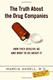

# 

> 原文：<http://www.aaronsw.com/weblog/001626>

每当有人想谈论我们的社会有多伟大时，似乎总是会出现一个例子，那就是制药公司发明的许多创新和强大的新药。也许这只是公司每年花费在营销上的 540 亿美元，其中很大一部分花在了广告上，谈论制药公司有多创新和有帮助，但看起来这些救命的神奇药丸确实抓住了公众的想象力。

但是在她的新书《关于制药公司的真相》中，受人尊敬的《T2 新英格兰医学杂志》前主编玛西娅·安吉尔表明，我们对制药公司的许多想法是错误的。首先，他们没有创新。信不信由你，制药公司根本不会对主要的新药进行研究。所有真正的研究都是在大学里完成的，由政府资助。

多亏了《拜赫-多尔法案》，大学可以利用公共资金为其员工的这些医学发现申请专利，然后将这些专利转而卖给制药公司，以换取一首相对的歌曲。通常情况下，大学已经完成了所有的工作——包括临床试验——而制药公司刚刚开始制造工厂。

因为制药公司已经购买了独家专利权，他们现在可以对这些药物收取他们喜欢的任何费用，而不用担心竞争。制药公司所做的小研究主要涉及开发“我也是”药物——稍微修改一点现有药物(甚至像改变颜色或涂层这样的小事情)，然后根据结果申请新专利，这样独家利润就会源源不断。得益于律师大军和美国食品和药物管理局的各种专利漏洞，制药公司可以利用各种专利伎俩让仿制药竞争对手在数年内望而却步。

即使竞争对手最终到来，制药公司的营销活动也开始了，鼓励每个人转向他们的新的、略有不同但已获得专利的药物。例如，以阿斯利康的烧心药普瑞洛塞(年销售额 60 亿美元)为例:当其专利用完时，阿斯利康从普瑞洛塞中拿走了不活跃的一半，重新获得了专利，并将其作为 Nexium 进行营销。然后，它进行了临床试验，将 20 毫克的普利洛赛克与 20 毫克的奈西姆进行比较，但由于一半的普利洛赛克没有活性，这就像比较 10 毫克的旧药物和 20 毫克的新药。有点令人惊讶的是，Nexium 的双倍剂量似乎只是稍微更有效，但 AstroZeneca 在一场涉及大量广告和大量免费样本的大规模营销活动中宣传了这些结果，这足以让医生在普利洛赛克专利到期前更换大多数处方。

这些营销活动是巨大的:每年 110 亿美元的免费样品，超过 60 亿美元的销售代表(每五个医生一个)，30 亿美元的消费者模糊广告。但除此之外，还有大规模的欺骗活动:贿赂医生、贿赂研究人员、贿赂大学、贿赂健康维护组织、提供回扣、开办州法律要求医生参加的“医学教育课程”、经营医院内的电视网络(这是一个很长的药物广告)以及资助欺骗性的研究(比如 Nexium one)，这些研究错误地让人觉得该公司的新药具有惊人的有益特性。

这些研究如此普遍，以至于当罕见的诚实研究完成时，结果令人难以置信。美国政府资助了一项名为 ALLHAT (8 年，42000 人，600 个诊所)的大规模研究，以比较高血压的不同治疗方法。它比较了一系列不同的流行现代药物(Norvasc、Cardura/doxazosin、Zestril/Prinivil/赖诺普利)，这些药物以不同的方式发挥作用，还比较了一种“古老的利尿剂”或“水丸”。结果令人震惊:利尿剂比昂贵的新型药物更有效，副作用更小——心力衰竭更少，中风更少，以至于试验中的卡杜拉部分不得不提前停止，因为很多人都得了心力衰竭。这些昂贵的新药不仅浪费了人们的钱(每人每年高达 678 美元)，还严重伤害了他们。

但是没有人开利尿剂，部分原因可能是因为没有人向医生推销利尿剂。美国食品和药物管理局没有要求制药公司将他们的新药与旧的治疗方法进行比较，所以医生无法知道哪种更有效。制药公司甚至不需要公布美国食品和药物管理局要求的研究。例如，导致美国食品和药物管理局批准抗抑郁药物(如百忧解、帕罗西汀、左洛复、塞来沙、赛尔宗和埃夫西克)的研究发现，安慰剂的有效性为 80%。但是这些研究直到 15 年后才公布，当时有人向食品和药物管理局提出了信息自由法案的要求。还有更糟糕的情况:几十年来，女性被开了雌激素和孕酮激素替代疗法，因为行业赞助的研究称这将预防心脏病。但是美国国家卫生研究院的一项大型临床试验发现，这种疗法实际上增加了心脏病！

我们的奇迹药丸乌托邦现在开始看起来有点像噩梦。制药公司用我们的税收来支付他们的研究，转而以高价卖给我们结果，将由此产生的利润用于大规模的宣传活动，以误导我们对其效果的认识，然后鼓励医生开一种昂贵的药丸，这可能没有多大帮助，甚至可能使事情变得更糟。年复一年，制药公司是迄今为止最成功的行业。他们用惊人的利润收买政客，并宣传公众保持这种状态。只有了解真实情况，我们才能开始反击。

*   [摘要节选自](http://www.nybooks.com/articles/17244)一书
*   [节选自第一章](http://www.alternet.org/envirohealth/19540/)
*   [从亚马逊购买](http://www.amazon.com/exec/obidos/ASIN/0375508465/ref=nosim/coolbooks02)

发布于 2005 年 3 月 25 日下午 06:27([Books](cat_books))([2 评论](#comments) ) [#](001626)

## 附近的

[prev](001622 "Summer Founders")|[up](./)|[next](001627 "The Truth About Maryland")

[劳伦斯·萨默斯案](001606)
[Blogshine 周日:美国绿灯，资金大屠杀](001614)
[科学造假](001616)
[迪士尼如何像苏联？](001618)
[暑期创始人](001622)
**制药公司真相**
[马里兰真相](001627)
T21【斯坦福:不可信先生
[资本主义的教训#1:分工](001632)
[斯坦福:看电影出来](001633)
[斯坦福:形式无内容](001634)

## 评论

亚伦——你必须阅读《纽约客》的文章来获得最近最好的分析，包括对你引用的书的一些批评。

本·卡斯诺查于 2005 年 3 月 25 日晚 08:33 发布 [#](#c4645)

我看到《纽约客》还在为他们的医药公司广告商挑水。格拉德威尔的事实似乎并没有反驳他所说的事情。他声称我们制药公司没有那么有罪，因为他们设法欺骗了其他人，这是荒谬的。他关于低仿制药价格证明高药品价格合理的说法毫无意义——两者之间没有财务联系。

我不知道有谁声称花在药物上的钱意味着药物价格太高，但格拉德威尔的整篇文章都围绕着这个稻草人，尽管安吉尔明确表示:“(三分之一)药物支出的增加反映了……人们服用的药物比过去多得多的事实”，然后继续分析药物价格的具体成本。

格拉德威尔甚至还堆了更多，暗示安吉尔必须真正支持从有需要的人那里拿走毒品！他抱怨说，安吉尔没有提到他未公布的研究，该研究发现，使用 PBM 进行两个项目的雇主减少了不到 5%，这似乎有点过分。

当格拉德威尔面对美国人不断选择昂贵药物的事实时，他感到困惑，因为他一直在为制药公司开脱。别管安吉尔在书中花了大部分时间解释原因，他只能得出结论，吸毒者是不理智的。

在这个框架中，他没有提到安吉尔的任何解决方案，比如不让我们为用我们的税款发明的药物支付额外费用，以及在没有证据表明更贵的药物效果更好的情况下阻止公司为它们做广告。这两种解决方案都比格拉德威尔提出的更多非我药物和 PBM 干涉的建议有效得多，但格拉德威尔甚至没有暗示它们。他忙着让他的读者去指责人民，而不是药品公司。

艾伦·施瓦茨发布于 2005 年 3 月 25 日晚 09:17[#](#c4646)

[订阅这篇帖子的评论。](feed:http://www.aaronsw.com/weblog/xml/001626.xml)

### 添加您的评论

如果你不想发表评论，你可以随时[通过电子邮件](mailto:weblog@aaronsw.com)把你的想法发给我。

<form method="post" action="http://notabug.com/mt/gorsnikat.cgi" name="comments_form" onsubmit="if (this.bakecookie[0].checked) rememberMe(this)" id="comments_form"><input type="hidden" name="static" value="1"> <input type="hidden" name="entry_id" value="1626">

<label for="author">姓名:</label> <input tabindex="1" id="author" name="author">
<label for="email">邮箱:</label> <input tabindex="2" id="email" name="email">(仅用于向您发送我的回复，从未发布或滥发)
<label for="url">网址:</label> <input tabindex="3" id="url" name="url">

还记得个人信息吗？<input type="radio" id="bakecookie" name="bakecookie">T1【是】T2<input type="radio" id="forget" name="bakecookie" onclick="forgetMe(this.form)" value="Forget Info" style="margin-left: 15px;">T4【否】T5

<label for="text">点评:</label>
<textarea tabindex="4" id="text" name="text" rows="10" cols="50">
 
<strong>注意:</strong>我可能会编辑或删除你的评论。(<a href="commentPolicy">更多...</a>)
 
<input type="submit" name="preview" value="Preview"/>
 </form> <address><a href="http://www.aaronsw.com/">Aaron Swartz</a> (<a href="mailto:me@aaronsw.com">me@aaronsw.com</a>)</address> </body> </html></textarea>

</form>