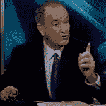
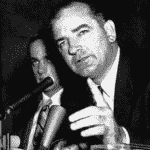

# 新麦卡锡:比尔·奥雷利

> 原文：<http://www.aaronsw.com/weblog/newmccarthy>

 

我正在阅读一篇关于乔·麦卡锡的反共听证会的旧文本，我惊讶地发现他的一些评论听起来非常熟悉。我做了一些谷歌搜索，我想我找到了原因:

麦卡锡:几天前，我读到艾森豪威尔总统表示希望，到 1954 年大选时，共产主义将成为一个死气沉沉、被遗忘的话题。残酷而令人不快的事实是，共产主义是一个问题，并将在 1954 年成为一个问题。

托尼·斯诺(奥莱利的代理人):今天早上，总统突然引用了周日《纽约时报杂志》的一句话，参议员克里称恐怖分子是一个讨厌鬼。([2004 年 10 月 10 日](http://mediamatters.org/items/200410130005))

麦卡锡:你知道(美国)公民自由联盟已经被列为“共产党的一个阵线，并在做共产党的工作”？

奥雷利:[T]毫无疑问，美国公民自由联盟和支持他们的法官是恐怖盟友。([2005 年 7 月 25 日](http://mediamatters.org/items/200507260002))

麦卡锡:现在，你在 1932 年写了一本书。我要再问你一次:在你写这本书的时候，你是否觉得教授应该有权教导二年级学生，婚姻——我引用——“应该作为过时和愚蠢的宗教现象被赶出我们的文明？”那是你当时的感觉吗？

O'REILLY:你可以理解像我这样的人，也许很多看的人认为你是一个疯狂的左撇子，当你的书，*狂热分子&傻瓜*[……]被下列人认可时:莫莉·伊文斯；比尔·莫耶斯比尔·马厄；和拉里·戴维。你为什么不让切·格瓦拉知道，哦，他死了。菲德尔·卡斯特罗怎么样？拜托，他们是最左边的边缘。那就是和你在一起的人……([2004 年 4 月 20 日](http://mediamatters.org/items/200404210002)

麦卡锡:如果一个愚蠢、傲慢或无知的当权者出现在我们的委员会面前，并被发现帮助共产党，他将被揭露。就我而言，他可能是将军这一事实使他不属于任何特殊阶层。

奥雷利:我们唯一能做的就是让向美国公民自由联盟筹款和捐款的人承担责任。在接下来的几周内，“因素”会告诉你这些人和组织是谁，这样你就可以决定是否想和他们做生意。([2005 年 8 月 5 日](http://www.foxnews.com/story/0,2933,164837,00.html))

麦卡锡:当呐喊和骚动平息后，美国人民和总统会意识到，新闻界和广播电台的极端左翼分子对委员会进行这种前所未有的诽谤，完全是因为另一个第五修正案共产主义者终于从黑暗的深渊中被挖出来，暴露在公众视野中。

奥赖利:进入希拉里·克林顿，她想坐在白宫。在本周的《新闻周刊》专栏中，自由派安娜·昆德兰滔滔不绝地谈论希拉里，称她是一个温和派。……这就是我所说的左翼媒体。对他们来说，像不受约束的堕胎、公立学校支持同性恋的教育……这些社会问题都是理所当然的。([2005 年 5 月 10 日](http://www.foxnews.com/story/0,2933,156041,00.html)

你应该在推特上关注我这里。

二零零五年十月十二日