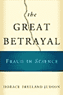

# 

> 原文：<http://www.aaronsw.com/weblog/001616>

*这里不可能发生。*这是大多数科学家会告诉你的科学欺诈。科学神奇地自我修正，欺诈者是孤立的事件，欺诈是发生在其他职业中的事情。嗯，他们都错了，正如霍勒斯·弗里兰·贾德森在他的新书《伟大的背叛:科学欺诈》中所展示的那样。虽然对欺诈的估计——伪造证据、省略或歪曲证据以及剽窃——自然很难得到，但即使是非常保守的研究也得出高达 10%的估计——对于那些相信科学的人来说，这是一个惊人的数字。

贾德森在不同时期都是一名历史学家、哲学家、社会学家、记者和科学学生，但他将所有这些结合成一本详细的书，将每个领域的精华结合在一起——新闻报道令人兴奋，可读性强，科学准确，历史和社会原因得到分析，等等。贾德森似乎对这个话题了如指掌——他出席每一个重大活动，在家里采访每一个重要人物，等等。结果是一本通书。

这本书追溯了欺诈的文化背景，分析了欺诈的历史(孟德尔、达尔文、巴斯德、弗洛伊德——都在某种程度上犯了欺诈罪)，非常详细地描述了许多现代欺诈案件(包括著名的“巴尔的摩事件”的一整章)，然后讨论了同行评议和作者身份的问题，大多数人认为这可以防止欺诈，然后通过互联网上的开放存取出版物展望了科学的未来，最后讨论了机构如何应对终结欺诈。

贾德森描绘了一幅陷入自身绝对正确感的科学界图景。告密者给大学校长带来了证据欺诈，他(几乎总是一个他)拒绝了他们，说“这不会发生在这里”。无论如何，科学是自我修正的。告密者被公开并被解雇——他们正在制造混乱，玷污大学的名声。政府的研究诚信办公室调查并得出结论，这是欺诈，但该案件被上诉到一个律师委员会，这些律师不懂科学，不被允许看科学证据，几乎总是推翻案件，提出似是而非的论点，比如“如果这些数据是欺诈的，它就不会看起来这么乱”。即使在欺诈行为被普遍承认的罕见情况下，所有常见的数据都显示出通常的“少数坏苹果”的说法——他们说，科学的其余部分都很好。当国会敢于就此事举行听证会时，被质疑的科学家声称政府正在攻击科学自由，这激怒了他们的同事。

因此，最终，举报者最终名誉扫地，失业，通常会在公共场合受到恶意攻击。如果情况真的很糟糕，欺诈者可能不得不去另一所大学，甚至提前退休。让事情发生在他头上的部门主管不会受到责备，因此也没有动力去改变事情。因此欺诈继续进行，没有调查，不受阻碍。

诈骗是什么样的？几个例子:

*   威廉·萨姆林(斯隆-凯特琳移植免疫学主任)声称，他可以将通常会被排斥的角膜、腺体和皮肤移植到动物身上——有时甚至跨物种移植。直到三年后，他才被发现，当时一名实验室助理注意到黑色的“皮肤图”是用记号笔画出来的(他的其他作品也被证明是假的)。

*   约翰·朗(一名居民)与麻省理工学院合作，在麻省理工学院研究霍奇金氏细胞株。一年后，一名初级同事指控诈骗，结果发现这些细胞系来自猴子和健康人。

*   Elias A. K. Alsabti(波士顿大学的一名研究员)在他 25 岁左右的时候已经发表了 60 篇论文，结果发现大部分都是发表在不知名的外国期刊上的论文，只有细微的变化(比如一个新的标题)。

*   耶鲁大学助理教授维贾伊·索曼(Vijay Soman)被要求对海伦娜·瓦希施利特-罗德巴德的一篇论文进行同行评审。他发回了一篇负面评论，推迟了发表，然后转身将同一篇论文提交给了另一家期刊。当海伦娜·瓦希施利特-罗德巴德被要求对索曼的论文进行同行评审，并承认这是她自己的论文时，他被发现了，这是命运的惊人转折。

*   约翰·达尔西发表了几十篇完全由数据组成的论文，并且在数据组成方面做得非常糟糕。(一篇论文声称一位父亲有四个孩子——分别是在他 8 岁、9 岁、11 岁和 12 岁时怀上的。)为了掩盖这一事实，Darsee 练习了“礼物作者制”——即使人们没有做任何工作，也添加他们作为共同作者。Darsee 在哈佛待了三年才被一些博士后发现，即使在那时，大学也花了五个月才承认欺诈。

*   斯蒂芬·布莱宁(匹兹堡大学)研究了某些镇定剂对精神病患者的长期影响。他的研究发现，这严重损害了病人，并导致精神病院改变程序。两年后，布莱宁在伊利诺伊大学的导师开始怀疑布莱宁不可能有时间做他声称正在做的所有工作。——果然是他编造的。Sparague(两个中的大一个，还记得吗)向国家精神健康研究所(NIMH)发送了一份报告，该研究所资助了 Breuning。布莱宁被迫辞职，NIMH 任命了一名调查员，继续调查斯普拉格。看到布雷宁的工作没有被调查和纠正，斯普拉格公开了。他的联邦资助被取消了。斯普拉格被要求在国会作证，作为回应，匹兹堡大学威胁要提起诽谤诉讼。

这只是一个小样本，案件还在继续。贾德森揭露了一个鲜为人知的话题，值得称赞。

*   [从亚马逊购买](http://www.amazon.com/exec/obidos/ASIN/0151008779/ref=nosim/coolbooks02/)
*   [发布者网页](http://www.harcourtbooks.com/bookcatalogs/bookpages/0151008779.asp)

发布于 2005 年 3 月 14 日上午 11:54([Books](cat_books))([8 评论](#comments) ) [#](001616)

## 附近的

[prev](001614 "Blogshine Sunday: US Greenlights, Funds Genocide")|[up](./)|[next](001618 "How is Disney like the Soviet Union?")

[斯坦福:你真的不用读这个](001600)
[对此你能说什么？](001598)
[共和党剧本](001599)
[针对劳伦斯·萨默斯的案件](001606)
[Blogshine 周日:美国绿灯，资金种族灭绝](001614)
**科学欺诈**
[迪士尼如何像苏联？](001618)
[夏季创始人](001622)
[关于制药公司的真相](001626)
[关于马里兰的真相](001627)

## 评论

在我看来，对所有这些欺诈案件的侦破，是科学能够自我纠正的合理证明。人们的职业生涯并没有像你所希望的那样被彻底摧毁，这一事实并不是反对这一观点的证据。当人们说科学是自我修正的时候，他们的意思是知识体系在不断地改进，因为欺诈和不良的工作正在被根除。它们并不意味着欺诈的科学家会因为不诚实而入狱。

迈克尔于 2005 年 3 月 14 日下午 06:14 发布 [#](#c4494)

我不在乎相关的人会怎么样，那不是我的重点。(我个人认为他们不应该受到惩罚。)不，看看这些东西是如何被发现的:大多数是实验室里的小人物，他们看到一些奇怪的事情，就大声说出来。谁知道有多少东西没有被小实验室的人抓住？有多少实验室的人不说话？(匿名调查显示，有大量的人看到过欺诈，但没有向任何人报告。)有多少人报案却被忽视或威胁？一直不停。这些只是被抓的案子，谁知道表面下有多少？

这种程度的欺诈对科学的一般“知识体系”有重大影响吗——我对此表示怀疑。但这并不意味着它没有影响——虚假的抗精神病药数据确实影响了精神病患者，还有许多其他例子。

艾伦·施瓦茨发布于 2005 年 3 月 14 日下午 06:59[#](#c4495)

我在这里看到两种欺诈。首先，数据和结果都是伪造的。在第二种情况下，实验方法本身是好的(或者我希望如此)，但是结果是从实际的研究人员那里窃取的，并由声称拥有所有荣誉的其他人发布。

由 [bi](http://notabug.com/mt/gorsnikat.cgi?__mode=red;id=4497 "http://mncw.tk/") 于 2005 年 3 月 15 日凌晨 03:37 发布 [#](#c4497)

书中有多少欺诈指控是在物理或化学等领域提出的？在我看来，这些指控大多与生物技术相关学科的欺诈有关。随着过去几十年生物技术领域支出的大幅增加，对结果的压力会让一些人做一些不太体面的事情也就不足为奇了。

托比于 2005 年 3 月 16 日上午 12:55 发布 [#](#c4500)

大多数情况下，研究人员只是在编造数据。那不重要。其他实验室可以跟进这项工作，并表明它是不一致的。在这方面，科学是自我修正的。NIMH 只以一名研究人员的研究为基础来修改治疗方法是不负责任的。

此外，这些案例中有很多涉及医学研究人员，在我看来，医学研究几乎不能算作科学。他们的样本量通常很小，但他们掩盖了这个事实。我看过四个病人的医学研究论文，他们说成功率是 75%。

然而，不道德的竞争是一个严重的问题。每个人都有这样的故事。科学依赖于思想的公开交流，许多人滥用这一点。它通常采取“窃取”不太成熟的研究人员的初步工作和想法的形式。一位拥有小实验室的新教授在一个项目上有了一个有希望的开端。一个更有地位的教授接受了这个想法，并且有了一个更大的实验室和更多的资源，先发表一篇论文。这是一个很难解决的问题，因为这实际上是缺乏职业尊重，而不是彻头彻尾的欺诈。

贾斯汀于 2005 年 3 月 16 日下午 12:23 发布 [#](#c4509)

贾斯汀说“其他实验室可以跟踪(欺诈性的)工作，并显示它是不一致的”。但是没有为复制研究提供资助，因此很少进行复制研究，建立在欺诈性研究基础上的研究通常假设它是真实的，因此不会出现任何不一致。

我认为“不道德竞争”的问题不在于“缺乏职业尊重”——问题在于竞争。

艾伦·施瓦茨发布于 2005 年 3 月 16 日晚 08:27[#](#c4523)

很酷的评论-谢谢分享。一个吹毛求疵的问题:在你提供的第一个欺诈例子中，你说:“威廉·萨姆林……声称他可以将正常情况下会移植到动物身上的角膜、腺体和皮肤——有时甚至跨物种移植。”

“通常会”什么？是“被拒绝”吗？只是好奇。谢谢！

迈克尔于 2005 年 3 月 16 日晚上 08:46 发布 [#](#c4524)

一本有趣的书；托比对物理和化学感到好奇。一个有趣的例子是利奥·帕奎特，他审查了某人的资助，然后在备受推崇的《美国化学学会杂志》上发表了他自己的资助背景材料。最终，俄亥俄州立大学认定这是抄袭，然而那里的化学系辩称，这并不重要(因为被取消的不是实际实验，只是某人的散文和研究工作)。国家科学基金会禁止帕奎特获得两年的联邦资金，但在禁令解除后，他获得了 50 万美元的资金。所以这并没有扼杀他的事业，尽管我想知道是否有不太知名的人做过，会吗？如果那些在该领域更杰出的人实际上应该被要求达到更高的标准，而不是更低？或者至少只吃自己的年轻人(也就是研究生)而不吃别人的年轻人！？

米歇尔于 2005 年 3 月 16 日晚上 11:18 发布 [#](#c4571)

[订阅这篇帖子的评论。](feed:http://www.aaronsw.com/weblog/xml/001616.xml)

### 添加您的评论

如果你不想发表评论，你可以随时[通过电子邮件](mailto:weblog@aaronsw.com)把你的想法发给我。

<form method="post" action="http://notabug.com/mt/gorsnikat.cgi" name="comments_form" onsubmit="if (this.bakecookie[0].checked) rememberMe(this)" id="comments_form"><input type="hidden" name="static" value="1"> <input type="hidden" name="entry_id" value="1616">

<label for="author">姓名:</label> <input tabindex="1" id="author" name="author">
<label for="email">邮箱:</label> <input tabindex="2" id="email" name="email">(仅用于向您发送我的回复，从未发布或滥发)
<label for="url">网址:</label> <input tabindex="3" id="url" name="url">

还记得个人信息吗？<input type="radio" id="bakecookie" name="bakecookie">T1【是】T2<input type="radio" id="forget" name="bakecookie" onclick="forgetMe(this.form)" value="Forget Info" style="margin-left: 15px;">T4【否】T5

<label for="text">点评:</label>
<textarea tabindex="4" id="text" name="text" rows="10" cols="50">
 
<strong>注意:</strong>我可能会编辑或删除你的评论。(<a href="commentPolicy">更多...</a>)
 
<input type="submit" name="preview" value="Preview"/>
 </form> <address><a href="http://www.aaronsw.com/">Aaron Swartz</a> (<a href="mailto:me@aaronsw.com">me@aaronsw.com</a>)</address> </body> </html></textarea>

</form>