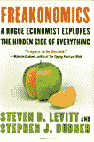

# 

> 原文：<http://www.aaronsw.com/weblog/001688>

我碰巧正在上社会学方法的课。前几天我们有一节课，助教给我们展示了如何使用 SPSS，一个图形用户界面的统计分析程序。通常这样的计算机演示非常无聊——在这里下拉这个菜单，在这里点击这个按钮，等等——但是这个演示很神奇:它使用了真实的数据。

助教从加州下载了一份风险资本家的名单。然后他从联邦选举委员会下载了政治竞选捐款的记录。他合并了这两个文件，并计算了一个政党忠诚度指数——每个人向民主党或共和党捐款的可能性有多大。然后他把它绘制成图表。他在数据中发现了一个异常，于是回去调查了一下。

整个表演奇怪地吸引人，事后我上去问他问题。“所以你对统计学感兴趣？”他问我，我答应了，开始思考为什么。我决定是因为我喜欢真相。如果你喜欢发现真相——这往往令人惊讶——最好使用的技术是科学。如果你想做严肃的科学研究，迟早你可能需要统计数据。

在令人惊讶的统计领域，有一个名字经常出现:史蒂文·d·莱维特。而且——惊喜，惊喜——莱维特出了一本新书《魔鬼经济学》。(顺便说一下，莱维特一定有一个很棒的公关，因为这本书受到了大量的炒作。这是一本好书，但没有宣传的那么好。[^fn1]尽管如此，我还是会把这个放在一边回顾它。这本书包括对莱维特和其他有趣的经济学家的论文的普及。

因此，这本书没有太多的主题，而是涵盖了一堆离奇的话题:学校老师和相扑运动员如何作弊，吃百吉饼的人如何不作弊，房地产经纪人和外科医生如何不把你的最大利益放在心上，如何打败三 k 党，如何*最薄弱环节*参赛者如何展示种族主义，在线约会者如何撒谎，毒品交易如何像麦当劳一样运作，堕胎如何推翻政府和打击犯罪，如何成为一个好父母，以及你可以从孩子的名字中学到什么。

尽管他有着不同寻常的兴趣和开放的心态，但莱维特仍然是一名经济学家，并拥有经济学家典型的右翼假设:最显著的是，对激励的坚定承诺和对社会秩序的无条件信仰。对于前者，它取笑犯罪学家，坚称惩罚威慑罪犯的证据“非常有力”，但没有提供一个引用(书中几乎所有其他内容，甚至众所周知的事实，都被一丝不苟地引用)。对于后者，他们只是假设智商是对智力的准确和遗传的衡量，尽管这方面明显缺乏证据。

此外，在一个使用父母访谈来挑选哪些育儿技巧最有效的部分，作者几乎完全忽略了父母说谎的可能性——这是他们在其他地方没有的遗漏。例如，他们发现说你给孩子读书和你的孩子在学校表现好之间没有关联。由此他们得出结论，阅读并不重要；一个更可能的解释似乎是，几乎所有的父母都声称他们给孩子读书。(感谢布拉德·德龙[的这次批评](http://delong.typepad.com/sdj/2005/03/freakonomics.html)。)

但它仍然是一本有趣的书。然而，我认为它最重要的一点是没有明确说明的:通过对数字的适当调查，我们可以更好地了解我们的世界。

*   [官网](http://freakonomics.com/)
*   [从亚马逊购买](http://www.amazon.com/exec/obidos/ASIN/006073132X/coolbooks02/)

[^fn1]:]莱维特感兴趣的东西——他的书之所以有趣——是社会学研究的领域社会。从这个意义上说，《魔鬼经济学》确实是一本社会学的书。然而，它对社会学家的态度可以被戏谑为“谢天谢地，一位社会学家冒着生命危险，在一个贩毒团伙中呆了四年，因为他设法找到了几本商业交易笔记本，可以交给一位经济学家！”人们可能会认为，一个由四年嵌入式研究产生的贩毒团伙的照片可能比几本笔记本更有趣，但显然不是。

即使没有专业合著者的帮助，社会学家也写了许多写得非常好、非常迷人的书，但他们中没有人见过像这本书这样的宣传。我不认为这是一个巧合，一个经济学家花了很长时间才写了一本社会学的书，然后才被公之于众。社会学提出了太多关于社会的问题，但是一个经济学家可以做一些有趣的事情，同时继续支持现状。(即使是莱维特最激进的发现——堕胎合法化将犯罪率降低了一半——也让他坚持认为这一发现与公共政策没有直接关系。)

贴出 2005 年 4 月 23 日下午 03:16([教育](cat_education) ) ( [11 评论](#comments) ) [#](001688)

