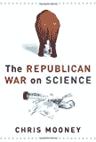

# 共和党的科学战争

> 原文：<http://www.aaronsw.com/weblog/gopwar>

我们想象，科学是客观公正的天才从他们昂贵的设备中报告发现的领域，告诉我们关于世界的真相。另一方面，政治被视为肮脏腐败的混蛋的场所，他们在做的每件事上都向我们撒谎，并试图让一切都符合他们现有的世界观。所以，当这两件事相遇时，我们是在表演，这有什么奇怪的吗？

记者克里斯·穆尼因撰写杂志文章而出名，这些文章使这个交叉点，尤其是在布什政府时期，变得有趣起来。他最近出版了他的第一本书《共和党对科学的战争》，试图将各种各样的个人故事结合成一个科学政治化的诅咒案例。这本书涉及各种主题，包括:

*   全球变暖
*   营养指南
*   捕鱼条例
*   演变
*   胚胎干细胞
*   安全性行为

每个人都有一章是以杂志文章的风格写的(事实上，许多是以杂志文章的形式发表的)，以一个有趣的人或事件开始，并扩展到展示一群布什的支持者(来自主要行业和宗教右翼)是如何炮制他们自己的伪科学的，试图传播对真相的困惑，特别关注它在穆尼所在的华盛顿的影响。穆尼用一些关于保守主义者和科学之间关系的更一般的想法来结束这些故事。

这本书取得了意想不到的成功，最近登上了《纽约时报》的畅销书排行榜，穆尼一直忙于为它做巡回售书。当他在街对面的波特广场书店演讲时，我去见了他，后来当他在我的稿子上签名时，我和他聊了一会儿。观众很感兴趣，也很投入。我怀疑这很大程度上是典型的对布什政府的愤怒(或者“华盛顿和媒体中的新保守主义激进分子”，就像那些打电话给电台节目等的愤怒分子似乎总是说的那样)，但我认为这个特殊的问题触及了人们对政府不喜欢的核心:政府拒绝接受现实，即使是最纯粹的形式。

这本书本身是一部值得尊敬的、可读性很高的作品(我在一天的空闲时间里浏览了一遍)，尽管我不禁感到有些失望。为了获得尊重，穆尼采取了一种超然的新闻风格——几乎是法律风格。尽管穆尼在事实上没有手下留情——他会称谎言为谎言，并拒绝被拉入将保守科学滥用等同于自由科学滥用的陷阱——但这种风格缺乏穆尼更尖锐的网络写作的气魄，比如当他写迈克尔·克莱顿的全球变暖否认主义小说《恐惧状态》时:

> 让我们面对现实:这样的写作对否认全球变暖的人来说纯粹是色情，就像虚构的不明飞行物绑架怀疑论者转变为真正的信徒的故事刺激不明飞行物粉丝一样。[……]在这本书的结尾，人们只能问:迈克尔·克莱顿生活在哪个星球上？因为这个明显变暖了。([引用](http://www.csicop.org/doubtandabout/crichton/))

相比之下，穆尼长达一本书的关于布什政府扭曲和不诚实的众多事件的揭露更像是这样总结的:

> 这些考虑都表明，随着布什政府的上台，科学政治化已经到了最低点[……]这样考虑，布什政府对科学的滥用和扭曲越来越像是一种大规模的政治策略。(241f)

尽管穆尼试图保持温和和公平，但他没有赢得媒体的任何青睐。*出版商周刊*在一篇好评评论中称其为“可读性很强，可以理解的党派性”，而*华盛顿邮报*则抨击其为“令人惊讶的缺乏说服力”、“论战性的【al】”和“一种阴谋论”。因为主流显然已经准备好考虑这本书的党派性，不管它的风格如何，穆尼可能会写得更强烈一点。

但是保守的读者呢？在签售会上，有人问穆尼，他是否认为这本书会到达他们手中。穆尼怀疑任何相关的政治家会真的读它。但是，你知道，也许有人会对他们说，“事情变得如此糟糕，以至于现在有一本书声称我们正在与科学开战！”他说。也许那会有一些效果。'

你应该在推特上关注我这里。

2005 年 9 月 24 日