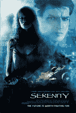

# 宁静

> 原文：<http://www.aaronsw.com/weblog/serenity>

于是*巴菲*顺其自然，*天使*被取消，*萤火虫*看到了它不合时宜的灭亡。但对乔斯·韦登来说，一切都还没有结束——萤火虫回来了，这次是在故事片 *[宁静](http://www.serenitymovie.com/)* 中。和其他顽固的乔斯·韦登球迷一样，我也在我的座位边缘。据说这部电影会很精彩。

在这个左右博客圈两极分化加剧的时代，在这个无休止的带有政治色彩的文化批判的时代，更重要的是看到一些我们可以团结在背后的流行文化。这就是为什么很高兴看到[右翼的领先博客](http://instapundit.com/archives/025717.php)和[左翼的领先博客](http://www.talkingpointsmemo.com/archives/week_2005_09_18.php#006614)能够以令人印象深刻的营销策略支持这部电影。这部电影是这样描述的:

> 奥斯卡和艾美奖提名的作家/导演乔斯·韦登，负责《吸血鬼猎人巴菲》《T2》《天使》《T4》《萤火虫》《T5》的全球电视现象，现在在他的故事片导演处女作《宁静》中，将他标志性的同情心和机智运用到了一小群 500 年后被银河系抛弃的人身上。这部电影围绕着马尔科姆·雷诺兹船长展开，他是银河内战中的一名经验丰富的老兵(失败的一方)，现在靠在他的船“宁静”号上犯下的小罪和出租运输为生。他带领着一小群不拘一格的人，这些人是他留给家人的最亲近的东西——争吵不休、不服从命令、忠心耿耿。

我无法告诉你我有多激动，能在波士顿买到两张预演的票！这个地方几乎充满了关于这件事的议论——家人、朋友、聚会上的随机人群都在谈论这件事。看完之后我一定会告诉大家它有多棒。

更多信息，包括预告片，请查看*宁静*网站。

你应该在推特上关注我这里。

2005 年 9 月 24 日