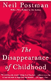

# 思想的消失

> 原文：<http://www.aaronsw.com/weblog/postmankid>

尼尔·波兹曼通常被认为是一个深思熟虑的自由主义批评家，他批评技术及其对我们文化的有害影响。我的朋友称赞他对电视的抨击和对教育的反思。但看完他的*《童年的消失》*，我很难把他当回事，他在书中认为(第 87 页)电视是不好的，因为它教会孩子同性恋是正常的，并称赞道德多数是唯一一个意识到这个重要真理的群体。诚然，他承认说“这种情况必然和明确地意味着文化退化”是夸大其词，但他坚持认为这显然“构成了危险”。

波兹曼的论点是，童年是印刷机的创造，这导致了一种文化，在这种文化中，学习阅读是成为成年人的必要条件，因此儿童成为了一个独立的群体。同样，他认为，电视的出现，不需要特殊的训练来观看，正在摧毁儿童和成人之间的区别，并把我们带回识字前的时代。

邮递员从来没有解释过为什么这应该被认为是一件坏事。相反，他的书只是简单地假设，很明显，我们需要假装不让孩子说调皮的话(尽管他们无论如何都知道这些话)，我们需要让孩子很难了解性，我们需要为他们假装政治领导人是不会犯错的，等等。

人们几乎倾向于认为这本书是开玩笑的，这种印象得到了第二版序言的帮助——这是唯一一个真正考虑孩子的地方——序言引用了邮差收到的学生的来信，他们读过这本书的部分内容，完全不同意他关于童年正在消失的论点。然而，他们并不批评童年本身，所以波兹曼认为他们赞成童年，并称赞他们是“保护童年的力量”，一种“道德上的多数”。

这就是整本书的问题所在。波兹曼调查了童年和现代思想史，发现它是印刷机的产物，因此是一个社会实体，而不是生物实体。但他没有调查结果是好是坏，而是直接忽略了自己的工作，直接假设结果一定是好的。我们在这里见证的不是童年的消失，而是思想的消失。

你应该在推特上关注我这里。

2006 年 1 月 28 日