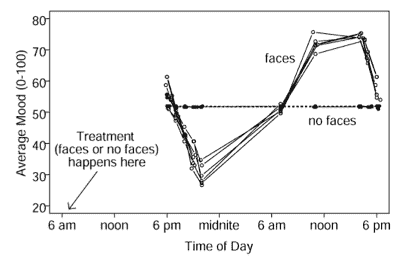

# 面孔会导致抑郁吗？:科学中的自我实验

> 原文：<http://www.aaronsw.com/weblog/facedepress>

塞斯·罗伯茨说，这一切都是从他想要更多的实验练习开始的。手头上最亲近的人是他自己。他正试图治疗他的痤疮，尽管确信药丸有效而面霜无效，他还是决定绘制出它们的效果图以备练习。结果与他预期的完全相反——面霜有帮助，药片没有。他的粉刺消失了，罗伯茨去寻找更大的问题来解决。

* * *

很明显，睡眠遵循某种循环节奏，这是一种内在的生物钟，让我们在一天结束时感到疲惫，在开始时感到精神焕发。例如，这是我们旅行时被甩出的时钟，从而导致时差反应。但是，如果除了我们睡觉的时候，其他事情扰乱了时钟呢？

对罗伯茨来说，这不仅仅是学术上的，他对一场严重的“早醒”感到沮丧，在这场“早醒”中，他会在凌晨 4 点左右醒来，感到疲倦，但又无法再睡几个小时。罗伯茨寻找一种方法来解决他的问题，但是没有一种标准的方法是合适的。所以他决定研究这个课题。

1979 年对洞穴中的人进行的一项研究表明，与其他人的接触会在我们睡着时受到影响，1985 年对 12 个国家的日常活动进行的一项调查得出了另一条线索:美国人在午夜前后比任何其他国家的人都更经常醒来，唯一的区别因素似乎是深夜电视。罗伯茨想，也许看电视会影响睡眠节奏？

在这项研究进行的时候，最受欢迎的深夜电视节目是《今夜秀》，它有着沉重的独白。所以一天早上罗伯茨决定看杰·雷诺和大卫·莱特曼的独白。这似乎没有影响；原本正常的一天。但是第二天早上*醒来时感觉很好。*

很难相信这个电视节目会对此负责，所以罗伯茨决定将这项研究正式化。他每小时都会写下三个 0 到 100 之间的数字，来衡量他有多不开心/快乐、易怒/平静、不情愿/渴望。然后他又试着打开和关闭电视，看看是否影响了他的情绪。确实如此——第二天他总是感觉好些。所以他试着调整节目和电视机，发现尽管他喜欢《辛普森一家》，但在大约一米远的地方真人大小的人脸保持 30 分钟效果最好。

在这一点上，我不得不承认，结果听起来相当荒谬和不可思议。但是阅读罗伯茨关于这个主题的论文，引人注目的是他对这个主题是多么的谨慎。一个真正的心理学家，发表在心理学杂志上，他考虑了所有的反对意见。结果*不能像人们首先期望的那样，仅仅是由他自己的意愿自我诱导的。首先，罗伯茨做定量笔记，所以他的记忆不可能在捉弄他。另一方面，这种差异太大，无法通过正常的解释来解释。如果罗伯茨可以简单地*将*自己唤醒快乐，为什么他以前没有这样做？这样的解释也无法解释这些数字对看电视和人的面部接触有多相似的谨慎敏感性，尤其是因为罗伯茨最初希望能够观看他最喜欢的节目，而不是像查理·罗斯这样的面部表情沉重的节目。*

他也开始注意到一些他没有预料到的事情——他的情绪不仅在第二天早上有所上升，而且在那天晚上有所下降。该图显示了模式:

情绪从早上 6 点到中午飙升，白天保持高涨，然后在下午 6 点左右潜水。(看不到脸的时候，情绪保持平淡。)

那些晚上看电视的人呢？罗伯茨发现，下午 6 点后看电视也会降低情绪，效果越晚越明显。

这是怎么回事？如果你早上看脸，12 小时后你会感觉更差，但 24 小时后会感觉更好。但是如果你在晚上看到人脸，效果会减弱。罗伯茨的理论是，你的身体正在利用面部来设定它的内在情绪时钟，它的工作原理类似于它的内在疲劳时钟。你想在白天快乐(相对于晚上)，但是你怎么知道一天什么时候开始？身体假设你醒来时和人聊天，所以它用看到其他人的脸作为同步时钟的方式。当然，你也想确保你在夜间的时间安排是正确的，所以如果你在晚上很晚的时候看到人脸，它也会试着调整时钟。

这与我们从其他渠道了解到的抑郁症是一致的。抑郁症与失眠和社会孤立高度相关，通常通过扰乱睡眠来治疗。阿米什人一起吃早餐，很早就上床睡觉，他们的抑郁症发病率是其他美国人的 1/100。20 世纪，抑郁症发病率增加了 10 倍，与此同时，收音机/电视、电灯和其他类似的东西变得普遍起来。

我希望有机会亲自测试一下，但是看起来改善情绪的一个简单方法就是早上看脸。

* * *

当然，除了情绪(通常被认为很难改变)，人们更想改善自己的外表。罗伯茨也对此进行了研究，得出结论，人体使用类似的内部系统来测量理想体重。结果是他的香格里拉饮食法，使用类似的技术欺骗身体内部系统来减少食欲。他的书《香格里拉饮食》 本周出版。它被誉为一本与众不同的减肥书。下次会有更多。

你应该在推特上关注我这里。

2006 年 4 月 23 日