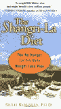

# 奇迹饮食

> 原文：<http://www.aaronsw.com/weblog/miraclediet>

你吃有热量的食物。你做的事情会燃烧卡路里。剩余的卡路里以脂肪的形式储存起来。因此，典型的减肥建议是:少吃，多运动。摄入的热量更少，燃烧的热量更多，因此脂肪更少。只有一个问题:那真的很难。为了燃烧足够的卡路里来减肥，你真的需要投入大量的时间。如果你试着少吃，你的身体会一直感到饥饿，因为它想要更多。

那么，如果你不是强迫你的身体少吃，而是教会你的身体少吃*想要*呢？毕竟很明显是肥胖，而不是缺少脂肪，这才是健康问题。所以让你的身体想要更少的食物是一件好事。这也会让节食变得极其容易——你根本不去努力计算卡路里或避免吃某些食物，而是什么都不做；你只是对吃不感兴趣。

这听起来像一个白日梦，但塞斯·罗伯茨认为这是可能的。根据对老鼠的大量研究结果、他自己在自己身上的实验以及对营养和减肥的最佳研究，他发展了一种理论，即身体如何决定吃东西的感觉。

他说，我们身体的重量由一个“设定点”来调节，就像恒温器上的设定一样。如果我们的体重低于我们的内部设定点，我们会感到饥饿；高一点，我们觉得饱了。所以如果你想减轻体重，你所需要做的就是降低你身体的设定值。你的身体会停止饥饿，你会燃烧你已经拥有的脂肪，你的体重会下降。

但是你会怎么做呢？罗伯茨认为，一个人的设定点不是固定的，而是根据他们吃的东西上下浮动。毕竟，当食物充足时，身体储存卡路里的全部原因是为了在食物匮乏的“歉收年”使用它们。因此，一个人的设定值在食物充足时上升(让他们积累脂肪)和食物匮乏时下降(这样他们就不会一直感到饥饿)是有意义的。

当然，问题是食物不再稀缺。你可以去麦当劳。身体在为一种永远不会到来的可能做准备。那你怎么让它停下来呢？也许你可以欺骗它，让它认为食物匮乏。

这就是罗伯茨的重要见解——他认为我们使用一种巴甫洛夫式的味道调节系统来观察食物是否稀缺。如果我们经常吃食物，我们会逐渐喜欢上它们的味道，因此我们的大脑会意识到我们吃它们是出于选择，并提高了设定点。另一方面，如果我们吃新的食物或味道不好的食物，我们的大脑会认为我们在吃它们，因为周围没有其他东西，设定点会降低。

因此，降低设定值的方法是:吃没有味道的食物。当然，它们也必须有热量，所以罗伯茨更喜欢的建议是超轻橄榄油(ELOO)，这基本上只是绝对没有味道的油。你的身体获得了热量，但没有获得味道，所以每次你吃它的时候，设定点都会变低。

这一切似乎都很疯狂，但罗伯茨是一个有点疯狂的家伙，所以他决定测试一下。他开始每天摄入几百卡路里无味的热量。几乎立刻，他开始感觉不那么饿了。他开始每隔一天吃一顿饭，即使还在锻炼，感觉很棒。他不费吹灰之力一周瘦了一磅。他瘦了很多，以至于他的朋友开始告诉他，他看起来太瘦了，所以他开始摄入更少的无味卡路里，体重又增加了一些。太神奇了。与众不同的饮食计划。

他把这件事告诉了朋友，这对他们也很有效。它被写在《纽约时报》上，读者来信说它为他们工作。博客开始记录人们的故事——几乎都是成功的。现在他昨天有了一本新书，*香格里拉饮食*，解释了如何做到这一点。

这本书很奇怪，因为它看起来很像任何其他愚蠢的减肥书，但内容相当不同。虽然很仓促，但这本书有一个科学研究附录，用老鼠来支持它关于理论的论点，并愉快地描述了那些尝试饮食并发现它不起作用的人和那些尝试饮食并发现它起作用的人的故事。

显然，这样的轶事证据不足以证明该系统是有效的，但它确实让尝试变得足够有趣。我已经开始摄入几汤匙额外的轻质橄榄油，我已经发现自己不吃饭了，这是我以前从未做过的事情。我们会看看进展如何。

*   [从亚马逊购买图书](http://books.theinfo.org/go/0399153640)

你应该在推特上关注我这里。

2006 年 4 月 26 日