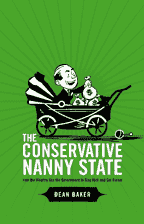

# 保守的保姆国家

> 原文：<http://www.aaronsw.com/weblog/cns>

多年来，进步人士一直关注着民主党和共和党政府在这个国家夺走了所剩无几的经济自由主义。例如，比尔·克林顿拿走了政府支付给贫困单身母亲的微薄援助，签署了北美自由贸易协定，并开始试图削减社会保障。

但比这些政策失败更糟糕的是作为其基础的观念上的失败。正如认知科学家乔治·莱考夫所说，人们通过概念道德框架来思考政治，而保守派则擅长为他们的政策创造框架。如果左派想要反击，他们将不得不创造自己的框架。

进入迪安·贝克，经济和政策研究中心的联合主任，也是反击最近试图将社会保障私有化的人之一(作为作者*社会保障:虚假危机*他有大量的事实来证明危机实际上是虚假的)。他出了一本新书《T2:保守的保姆式国家:富人如何利用政府保持富有并变得更富有》，这本书采用了几十年的保守框架，并让他们从头开始。(爆料:我非常喜欢这本书，我为他们把它转换成了 HTML，作为回报，我收到了一份免费的平装本。)

他最根本的观点是，保守派*而非*普遍支持市场结果。他认为，长期以来，左派一直满足于这样一种观念，即保守派希望市场为所欲为，而自由派则希望政府进行一些干预，以保护人们免受市场过度行为的影响。

*没门！贝克说。保守派*喜欢*大政府——只是他们用它来给富人而不是穷人钱。由此可见保守保姆状态的名头，总是在寻找爱哭的富翁帮忙。*

以贸易政策为例。这个保守的保姆式国家非常乐意签署自由贸易协议，让美国的制造业工作岗位流向海外。他们很乐意让移民工人进入这个国家来代替洗碗机和日工。但是说到职业阶层，像医生、律师、经济学家、记者等职业人士，*哦不！*，保守的保姆国家竭尽全力(通过许可和移民政策)将外国工人拒之门外。

这不仅帮助了医生，也伤害了我们所有人，因为这意味着我们必须为医疗保健支付更多的费用。北美自由贸易协定的支持者估计，整个协议每年节省 80 亿美元。利用竞争将医生的工资降低到欧洲的水平将为我们节省 800 亿美元——仅仅因为医生价格的提高，每个家庭每年就节省近 700 美元。你会从其他主要职业中看到类似的数量。

贝克的书也是为数不多的揭示美联储董事会背后令人震惊的秘密的书之一，你总是在新闻上听到他们篡改利率。这个不负责任的技术官僚，其大部分成员由银行任命，利用其对利率的权力将经济推向衰退，这样工资就不会太高。没错，政府试图减缓经济发展，这样你的工资就会减少。(全部细节都在书里。)

贝克的书中也充满了引人入胜的新政策理念。例如，他指出，企业不是自由市场的一部分，而是政府提供的礼物。(这也是非常受欢迎的一个，因为公司每年自愿为此支付 278 亿美元。)正因为如此，政府完全没有理由不调整条款，让我们过得更好。例如，贝克指出，目前，公司规则把根本不投票的股东算作投票支持公司董事喜欢的任何东西。贝克建议，要求所有首席执行官的薪酬方案都得到大多数实际投票者的批准，而不是让主要首席执行官像现在这样自己选择薪酬。

或者版权和专利呢？再说一遍，这不是自然规律，而是政府的大礼。真正关心缩减政府规模的人会试图废除或缩减法律，这些法律说政府可以制定规则，规定我们可以在个人电脑上播放哪些歌曲和电影。

美国人在处方药上花费 2200 亿美元，主要是因为政府授予的专利。政府可以花更少的钱(只有几亿)资助研究人员本身，并将由此产生的药物发现免费提供给公众，而不是把钱交给大型制药公司。大学生花费 120 亿美元。同样，政府可以免费提供千分之一的教科书。我们在音乐和电影上花费了 370 亿美元。为什么不创建一个“艺术自由代金券”(代金券——保守派的最爱！)那只能花在把作品放在公共领域的艺术家身上？

这些都不需要取缔现有的系统——它们可以并行工作，只是迫使现有的药物、教科书和电影公司与这种替代想法竞争。如果他们的版本效果更好，那好，他们会拿到钱的。但如果没有，就不会有保守的保姆国家来保护他们。

同样，政府可以扩大社会保障计划，允许每个人从一个管理费用低得惊人的系统中购买额外的个人账户，该系统的管理费用为 0.5%，而私人基金的管理费用为 20%，并且有 70 年的成功记录。或者，它可以试图通过让人们购买政府的医疗保险计划来改善我们糟糕得可怜的医疗保健系统，该计划的行政成本也非常低(你知道吗，以人均计算，我们在医疗保健上花费的 80%仅仅是行政费用？)和压低价格的强大议价能力。再说一遍，为什么不让民营企业尽力去竞争呢？

这本书本身也讨论了破产法、侵权和征用、小企业和税收。它深入到每一个主题的更多细节。而且在网上都是免费的，所以没有不看的借口。这是一本有趣的书，是那种颠覆你对经济的看法的书。

*   [官网](http://www.conservativenannystate.org/)
*   [PDF 版](http://www.conservativenannystate.org/cnswebbook.pdf)
*   [HTML 版本](http://www.conservativenannystate.org/cns.html)
*   [平装版](http://www.lulu.com/content/301875)

你应该在推特上关注我这里。

2006 年 5 月 22 日