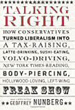

# 说得对

> 原文：<http://www.aaronsw.com/weblog/talkingright>

约翰·杜威有句名言，政府是大企业给社会投下的阴影。杰弗里·纳伯格在《正确说话》中认为，政治语言是政府投下的阴影。他指出，民主党人似乎认为语言有一种护身符般的力量，只要他们能找到正确的口号或口号，他们就能把人们拉到自己一边。“自由派”必须变成“进步派”，“家庭价值观”必须变成“重视家庭”。这种特技有一种智慧，作为伯克利的语言学家，纳伯格一定想相信它们。但他没有。他解释说，这些话只是更大的政治形势的副作用。杜威解释说，如果不改变实质，试图改变阴影将不会有任何效果，纳伯格由衷地同意这一点。

很难想象会有什么不同，但民主党人在政治话语中遭受了顽固的字面主义:认为他们可以通过启动减少官僚浪费的项目来击败大政府的指控，认为他们可以通过指出他们对宽容和公平的热爱来收回价值问题，认为他们可以通过戴上狩猎帽和步枪来逃避喝拿铁的指控。事实上，这些问题要深刻得多:大政府是对政府能做好事的观念的攻击，价值观指的是一种国家道德失控的感觉，啜饮拿铁的指控是试图转移选民对更大的阶级问题的注意力。纳伯格甚至批评他的同事乔治·莱考夫认为当前的一揽子政治立场有更深层次的含义，而不仅仅是历史的偶然。

纳伯格是一位散文家——他对 NPR 的《新鲜空气》的评论是国宝——他的风格虽然可读性很强，但并不能很好地翻译成长篇大论，他的观点在一大堆轶事中消失了。但是，在所有关于保守派如何吃更多的布里干酪和自由派曾经是每个人都宣称的外衣的故事之下，纳伯格的观点是一个熟悉的观点:如果民主党想要获胜，他们必须开始讲述关于经济精英如何攫取我们国家的财富以及我们如何需要政府收回这些财富的丰满的民粹主义故事。这一点同样适用于受欢迎，令人振奋的是，从另一个角度进行的调查得出了同样的结论。

*   [买书](http://books.theinfo.org/go/1586483862)

你应该在推特上关注我这里。

二零零六年十月十七日