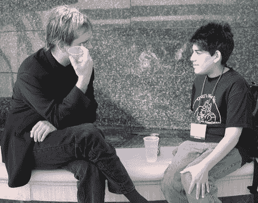

# 

> 原文：<http://www.aaronsw.com/weblog/000291>

 
*图片来源:Richard Gibson*

拉里看起来不像年轻的泰德·纳尔逊吗？金色的头发，棕色的鞋子，黑色的衣服…

发布于 2002 年 5 月 25 日下午 12:55([照片](cat_photos) ) [#](000291)

## 附近的

[prev](000287 "His New Weblogging Technique is… Unusual")|[up](./)|[next](000292 "Copyright Terrorism Continues")

[新兴科技 2002 年照片](000279)
[【必不可少的博客】供评论](000283)
[其他](000284)
[微软软件如此不安全，可能会付出生命的代价](000285)
[他的新博客技术是……不寻常的](000287)
**LarryL 和 AaronSw**
[版权恐怖主义仍在继续](000292)
[我是太空的可怕秘密！](000293)
[多线程生活](000296)
[本地无线](000297)
[未包含版权诉讼](000298)

<address>[Aaron Swartz](http://www.aaronsw.com/) ([me@aaronsw.com](mailto:me@aaronsw.com))</address>