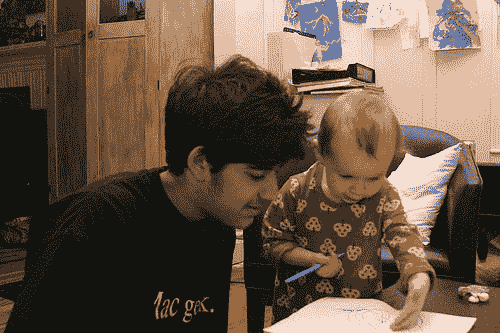

# FOO 营地

> 原文：<http://www.aaronsw.com/weblog/foo3>

我最近很兴奋被邀请参加 FOO 营，所有现代科技行业的领军人物都和我分享了他们的深刻想法。已经开始了一个成功的创业，我决定今年是时候回馈社区了，所以我和未来的创业者做了一些一对一的咨询。

这是一张我听后起之秀阿达·诺顿推销她新的小狗钓鱼网络应用框架的分层架构的照片。绝对值得一看——我已经建议 Y Combinator 立即投资。

 
( [更多照片](http://www.flickr.com/photos/quinn/search/tags:Aaron%2CAda/tagmode:all/))

我慷慨地给了 Ada 20%的正常咨询费折扣，以换取公司 10%的股份。我希望其他企业家能像我一样慷慨地回馈社会。

你应该在推特上关注我这里。

2005 年 8 月 25 日