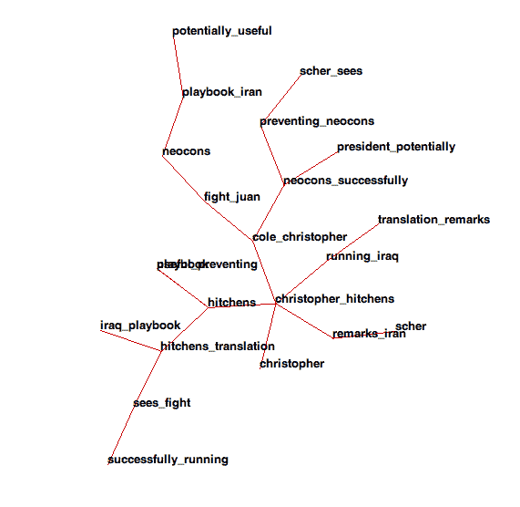

# 博客空间是什么样子的？

> 原文：<http://www.aaronsw.com/weblog/blogviz>

最近一直在分析博客的内容，寻找模式。这是一个巨大的数据量，这使得一些棘手的技术问题。最后，今晚，感谢朋友们的一些帮助和[大图布局](http://lgl.sourceforge.net/)包，我终于有了一些结果。它们非常漂亮。女士们先生们，博客圈:

为了好玩，让我们放大其中一个小污点:

你应该在推特上关注我这里。

2006 年 7 月 26 日